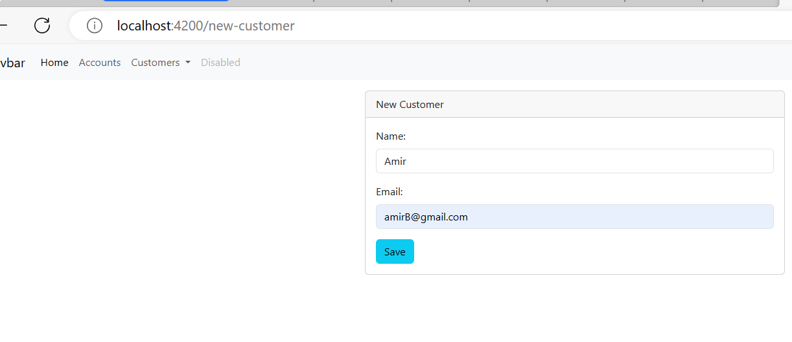

# Projet Frontend de Gestion de Comptes Bancaires avec Angular

## Introduction

Ce projet représente le frontend de l'application de gestion des comptes bancaires développée avec Angular. Il s'intègre avec le backend Spring Boot qui gère les fonctionnalités de gestion des clients, des comptes bancaires, et des opérations sur les comptes.

L'objectif principal de ce projet frontend est de fournir une interface utilisateur conviviale pour permettre aux utilisateurs d'interagir avec les fonctionnalités bancaires offertes par l'application.

## Fonctionnalités

- Ajout d'un nouveau client.
- Recherche de clients.
- Affichage des détails d'un client, y compris ses comptes bancaires associés.
- Recherche des opérations d'un compte bancaire.
- Exécution d'opérations sur un compte bancaire : débit, crédit, transfert.

## Composants Principaux

- **AppComponent :** Composant principal de l'application.
- **CustomersComponent :** Composant pour rechercher et supprimer un client.
- **NavbarComponent :** Composant pour la barre de navigation.
- **AccountsComponent :** Composant pour afficher la liste des comptes bancaires.
- **NewCustomerComponent :** Composant pour ajouter un nouveau client.
- **HomeComponent :** Composant pour la page d'accueil.
- **CustomerAccountsComponent :** Composant pour afficher les détails d'un client et de ses comptes bancaires associés.

## Services Utilisés

- **CustomerService :** Service pour gérer les opérations liées aux clients.
- **AccountService :** Service pour gérer les opérations liées aux comptes bancaires.

## Modules Utilisés

- `BrowserModule` : Module essentiel pour exécuter une application Angular dans un navigateur. Il fournit les directives de base nécessaires pour créer une application web.
- `AppRoutingModule` : Module permettant de définir les routes de l'application. Il facilite la navigation entre les différentes vues de l'application.
- `HttpClientModule` : Module qui fournit des fonctionnalités pour effectuer des requêtes HTTP. Dans ce projet, il est utilisé pour interagir avec le backend Spring Boot, récupérant ainsi les données nécessaires à l'affichage des informations.
- `ReactiveFormsModule` : Module qui expose des fonctionnalités pour travailler avec les formulaires réactifs. Les formulaires réactifs offrent un moyen puissant de gérer et de valider les formulaires dans une application Angular.

## Captures d'écran

### Page d'accueil

### Gestion des Clients

#### Liste des Clients

#### Ajouter un Client

#### Client Ajouté

#### Ajout de Client avec Nom Inférieur à 4 caractères
Si le Nom du client à ajouter est inférieur à 4, le bouton "Save" ne s'active pas.

Lorsque le nom est supérieur ou égal à 4, le bouton s'active.

- Code HTML pour le bouton Save :
  

- Code HTML pour les validateurs du NOM et de l'EMAIL afin d'activer le bouton Save du nouveau client :
  

- Mail non valide
  

- Nom non valide
  

#### Recherche d'un Client

#### Champs Requis

- Code HTML
  

#### Suppression de Client
- Avant suppression
  
- Lors de la suppression
  
- Après suppression
  

### Gestion des Comptes
#### Recherche d'un compte avec son ID

#### Opération de Débit

On remarque dans le tableau que l'opération de débit a été bien effectuée.

#### Opération de Crédit

On remarque dans le tableau que l'opération de crédit a été bien effectuée.

#### Opération de Transfert
Lors de la sélection de l'opération de transfert, un champ 'Account Destination' apparaît.

On remarque dans le tableau que l'opération de transfert a été bien effectuée ; elle s'enregistre comme débit.

On cherche dans le compte de destination, on va trouver une opération de crédit ajoutée due au transfert.

## Conclusion

Ce projet frontend d'Angular illustre l'intégration avec le backend Spring Boot pour créer une application complète de gestion de comptes bancaires. Il offre une interface utilisateur moderne et fonctionnelle pour interagir avec les fonctionnalités bancaires.

---

# DigitalBankingWeb

Ce projet a été généré avec [Angular CLI](https://github.com/angular/angular-cli) version 17.0.6.

## Serveur de développement

Exécutez `ng serve` pour lancer un serveur de développement. Accédez à `http://localhost:4200/`. L'application se rechargera automatiquement si vous modifiez l'un des fichiers sources.

## Scaffolding du Code

Exécutez `ng generate component component-name` pour générer un nouveau composant. Vous pouvez également utiliser `ng generate directive|pipe|service|class|guard|interface|enum|module`.

## Build

Exécutez `ng build` pour construire le projet. Les artefacts de construction seront stockés dans le répertoire `dist/`.

## Exécution des tests unitaires

Exécutez `ng test` pour exécuter les tests unitaires via [Karma](https://karma-runner.github.io).

## Exécution des tests end-to-end

Exécutez `ng e2e` pour exécuter les tests end-to-end via une plateforme de votre choix. Pour utiliser cette commande, vous devez d'abord ajouter un package qui implémente des capacités de test end-to-end.

## Aide supplémentaire

Pour obtenir plus d'aide sur Angular CLI, utilisez `ng help` ou consultez la page [Angular CLI Overview and Command Reference](https://angular.io/cli).
